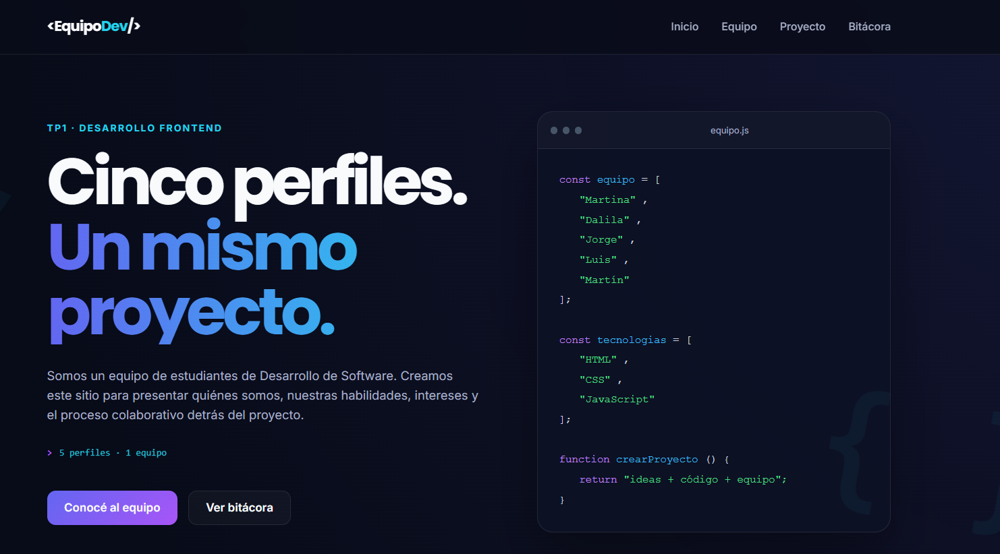
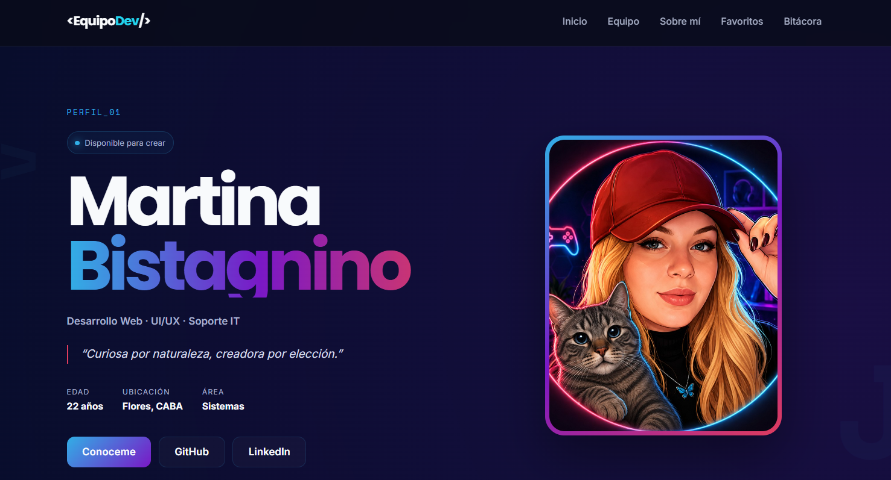
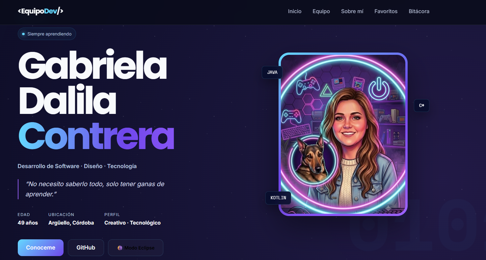
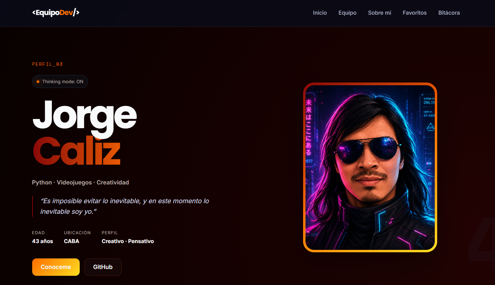
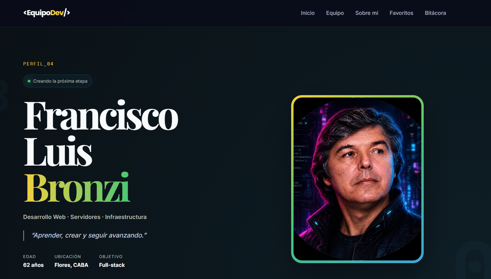
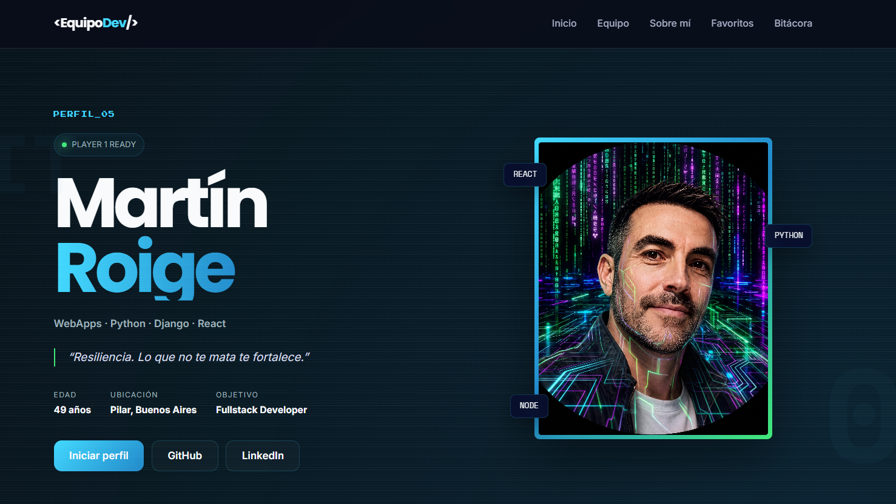

# 💻 Trabajo Práctico Grupal 1 — `<EquipoDev/>`

## Desarrollo de Sistemas Web Front End · 2026

**Institución:** IFTS N.º 29  
**Proyecto:** Trabajo Práctico Grupal 1  
**Tecnologías principales:** HTML5 · CSS3 · JavaScript Vanilla  
**Publicación:** Vercel  

---

# 📌 1. Descripción del proyecto

`<EquipoDev/>` es un sitio web grupal desarrollado como Trabajo Práctico Grupal 1 de la materia **Desarrollo de Sistemas Web Front End**.

El objetivo del proyecto es presentar a los cinco integrantes del equipo mediante una experiencia web compuesta por:

- una portada principal;
- una presentación general del equipo;
- cinco perfiles individuales;
- navegación interna entre todas las páginas;
- interacciones dinámicas desarrolladas con JavaScript;
- diseño responsive;
- criterios de accesibilidad web;
- una bitácora de desarrollo;
- documentación técnica del proceso;
- publicación mediante Vercel.

Cada perfil comparte una estructura visual común, pero posee una **identidad, paleta de colores e interacción JavaScript propia**, basada en los intereses y preferencias de cada integrante.

El proyecto fue desarrollado con un enfoque **responsive y adaptativo**, utilizando CSS Grid, Flexbox y media queries específicas para los breakpoints solicitados de **1200 px, 900 px y 400 px**, además de un breakpoint intermedio de 600 px.

También se incorporaron criterios de accesibilidad como navegación por teclado, estados ARIA, regiones dinámicas accesibles, indicadores de foco y soporte para usuarios que prefieren movimiento reducido.

---

# 👥 2. Integrantes

| Integrante | Perfil | GitHub | Enfoque |
|---|---|---|---|
| **Martina Bistagnino** | [Perfil 01](./martina.html) | [@Martina-bistagnino](https://github.com/Martina-bistagnino) | UI/UX · Desarrollo Web |
| **Gabriela Dalila Contrera** | [Perfil 02](./dalila.html) | [@DalilaContrera](https://github.com/DalilaContrera) | Desarrollo de Software · Creatividad |
| **Jorge Caliz** | [Perfil 03](./jorge.html) | [@JorgeGabrielCaliz](https://github.com/JorgeGabrielCaliz) | Python · Game Development |
| **Francisco Luis Bronzi** | [Perfil 04](./luis.html) | [@LuisUnix2100](https://github.com/LuisUnix2100) | Infraestructura · Desarrollo Web |
| **Martín Roige** | [Perfil 05](./martin.html) | [@TinchoHub](https://github.com/TinchoHub) | WebApps · Full Stack |

Todos los integrantes participaron en el repositorio mediante commits realizados desde sus propias cuentas de GitHub.

El desarrollo se realizó de manera colaborativa mediante sincronización con Git, utilizando principalmente:

```bash
git pull origin main
git add .
git commit -m "descripción del cambio"
git push origin main
```

Esto permitió mantener un historial visible de la evolución del trabajo y de la participación individual del equipo.

---

# 🧭 3. Arquitectura y navegación

El sitio está compuesto por siete páginas HTML principales:

1. `index.html` — portada del equipo.
2. `martina.html` — perfil de Martina.
3. `dalila.html` — perfil de Dalila.
4. `jorge.html` — perfil de Jorge.
5. `luis.html` — perfil de Luis.
6. `martin.html` — perfil de Martín.
7. `bitacora.html` — registro del proceso de desarrollo.

La navegación permite recorrer todo el sitio sin depender del botón **Atrás** del navegador.

Los perfiles se encuentran conectados de manera circular:

```text
Martina
   ↓
Dalila
   ↓
Jorge
   ↓
Luis
   ↓
Martín
   ↓
Martina
```

Cada página también permite regresar directamente a la portada o al listado general del equipo.

---

# 🛠️ 4. Tecnologías utilizadas

## HTML5

Se utilizó marcado semántico mediante elementos como:

- `<header>`
- `<main>`
- `<section>`
- `<article>`
- `<nav>`
- `<footer>`
- `<button>`
- `<blockquote>`

También se incorporaron atributos de accesibilidad como:

```text
aria-label
aria-live
aria-atomic
aria-expanded
aria-controls
aria-pressed
aria-hidden
aria-modal
```

---

## CSS3

El diseño utiliza:

- variables CSS;
- Flexbox;
- CSS Grid;
- `clamp()`;
- gradientes;
- transparencias;
- `box-shadow`;
- efectos glow;
- pseudoelementos;
- animaciones;
- transiciones;
- media queries;
- estilos específicos por perfil;
- `:focus-visible`;
- `prefers-reduced-motion`.

---

## JavaScript Vanilla

Todo el comportamiento dinámico fue desarrollado sin frameworks ni librerías externas.

JavaScript se utiliza para:

- menú mobile;
- actualización dinámica del DOM;
- terminales interactivas;
- cambio de estados ARIA;
- selección aleatoria de contenido;
- cambio de temas;
- reproducción multimedia bajo interacción del usuario;
- intro de bienvenida;
- administración de foco;
- almacenamiento temporal mediante `sessionStorage`;
- control de preferencias de movimiento reducido.

---

## Git y GitHub

Git se utilizó para:

- control de versiones;
- sincronización del proyecto;
- registro histórico de cambios;
- participación individual de los integrantes;
- resolución de actualizaciones realizadas por otros miembros.

GitHub funciona como repositorio público e independiente del TP.

---

## Vercel

Vercel se utiliza para publicar y mantener accesible la versión web del proyecto.

---

# 📂 5. Estructura de archivos

```text
/
├── index.html
├── bitacora.html
├── martina.html
├── dalila.html
├── jorge.html
├── luis.html
├── martin.html
├── README.md
│
├── css/
│   ├── styles.css
│   ├── perfiles.css
│   └── responsive.css
│
├── js/
│   ├── main.js
│   ├── martina.js
│   ├── dalila.js
│   ├── jorge.js
│   ├── luis.js
│   └── martin.js
│
├── img/
│   ├── avatares/
│   │   ├── martina.jpg
│   │   ├── dalila.jpg
│   │   ├── jorge.jpg
│   │   ├── luis.jpg
│   │   └── martin.jpg
│   │
│   ├── capturas/
│   │   ├── capturaportada.png
│   │   ├── capturaperfilmartina.png
│   │   ├── capturaperfildaly.png
│   │   ├── capturaperfiljorge.png
│   │   ├── capturaperfilluis.png
│   │   └── capturaperfilmartin.png
│   │
│   └── Scorpion_Lair.jpg
│
└── audio/
    └── shao_kahn_laugh.mp3
```

### Organización

- `styles.css`: estilos globales, portada, navegación, componentes generales e intro.
- `perfiles.css`: estilos comunes y temáticas específicas de los cinco perfiles.
- `responsive.css`: adaptación para diferentes tamaños de pantalla.
- `main.js`: funciones compartidas de la portada.
- Cada perfil posee su propio archivo JavaScript para evitar mezclar responsabilidades.

---

# 🎨 6. Guía de estilos

## Tipografías

Las fuentes fueron incorporadas mediante **Google Fonts**.

### Inter

Utilizada principalmente para:

- textos generales;
- párrafos;
- navegación;
- interfaces.

### Poppins

Utilizada para:

- títulos;
- encabezados;
- elementos destacados.

### Space Mono

Utilizada en:

- terminales;
- comandos;
- etiquetas técnicas;
- elementos de estética de programación.

### Playfair Display

Utilizada principalmente en el perfil de Francisco Luis para reforzar su estética clásica y elegante.

### Press Start 2P

Utilizada en el perfil de Martín para construir una identidad visual retro gamer.

---

# 🎨 7. Paleta global

Las principales variables globales del proyecto son:

```css
--bg-main: #080b18;
--bg-secondary: #10152b;
--bg-card: rgba(17, 24, 48, 0.82);

--border: rgba(255, 255, 255, 0.09);

--text-primary: #f8fafc;
--text-secondary: #a8b0c7;

--accent-primary: #6366f1;
--accent-secondary: #22d3ee;
--accent-purple: #a855f7;
```

La identidad principal utiliza fondos azulados oscuros combinados con acentos neón en violeta y cyan.

---

# 👤 8. Identidad visual de cada perfil

## Martina

```css
Base:       #080d2c
Cyan:       #31afe6
Rosa:       #df3c5d
Violeta:    #7a18c6
```

Estética:

**Gamer · tecnológica · profesional · neón**

---

## Dalila

```css
Base:       #080b20
Cyan:       #64d8ff
Violeta:    #9d62ff
```

Estética:

**Futurista · espacial · tecnológica · creativa**

---

## Jorge

```css
Base:       #050505
Rojo:       #880808
Naranja:    #ff6d00
Amarillo:   #ffde21
```

Estética:

**Cyberpunk · retro · gaming · oscura**

---

## Francisco Luis

```css
Base:       #080b0d
Dorado:     #f4d03f
Verde:      #48c774
Azul:       #3da5d9
```

Estética:

**Vintage · elegante · tecnológica**

---

## Martín

```css
Base:       #071015
Cyan:       #42d9ff
Verde:      #42e87a
Azul:       #2188c9
```

Estética:

**Retro gamer · arcade · tecnológica**

---

# 🎯 9. Iconografía y recursos visuales

Para mantener el proyecto liviano se combinaron:

- símbolos ASCII;
- caracteres relacionados con programación;
- emojis nativos;
- avatares personalizados;
- efectos construidos mediante CSS.

Ejemplos:

```text
</>
{ }
0101
PY
FLB
8BIT
🎮
🎬
🎵
🐉
🐶
💻
```

Esto permite aportar identidad visual sin depender de una biblioteca de iconos externa.

---

# ⚡ 10. Interactividad JavaScript

La consigna requiere al menos una interacción dinámica en la portada y una diferente en cada perfil.

El proyecto implementa una experiencia particular para cada integrante.

---

## 🌐 Portada — `js/main.js`

### Menú mobile

El botón hamburguesa controla la apertura y cierre de la navegación en dispositivos pequeños.

JavaScript actualiza dinámicamente:

```html
aria-expanded="true"
```

o:

```html
aria-expanded="false"
```

para mantener sincronizado el estado visual con el estado accesible.

---

### Hero dinámico

La portada contiene un mensaje que cambia automáticamente entre diferentes frases relacionadas con el equipo:

```text
HTML · CSS · JavaScript
5 perfiles · 1 equipo
Diseño · Código · Colaboración
Aprender · Crear · Compartir
```

JavaScript modifica el contenido de `#dynamicText` mediante intervalos temporizados.

La región utiliza:

```html
aria-live="polite"
aria-atomic="true"
```

para permitir que lectores de pantalla detecten los cambios sin interrumpir al usuario.

---

### Intro de bienvenida

Al ingresar al sitio se presenta una pantalla inicial con:

- nombre del equipo;
- cinco avatares;
- identidad visual compartida;
- mensaje de bienvenida;
- botón de ingreso.

La presentación utiliza los avatares de:

```text
Martina · Dalila · Jorge · Luis · Martín
```

y el mensaje:

> Cinco perfiles. Cinco estilos. Un solo equipo.

La intro incorpora:

- diálogo accesible;
- administración del foco del teclado;
- cierre mediante botón;
- cierre mediante tecla `Escape`;
- soporte para navegación por teclado;
- almacenamiento mediante `sessionStorage`.

`sessionStorage` permite evitar que la presentación vuelva a mostrarse constantemente durante la misma sesión de navegación.

---

### Movimiento reducido

La portada detecta:

```css
prefers-reduced-motion: reduce
```

Cuando el usuario tiene configurada esta preferencia:

- se detienen animaciones innecesarias;
- se desactiva el scroll suave;
- se evita la rotación automática del hero;
- la intro aparece sin animaciones escalonadas;
- se reducen transiciones visuales.

De esta manera la experiencia mantiene el contenido sin obligar al usuario a visualizar movimiento continuo.

---



---

# 👩‍💻 11. Martina — Terminal interactiva

**Archivo:** `js/martina.js`

El perfil de Martina incluye una terminal inspirada en interfaces de desarrollo.

Los botones permiten consultar distintas categorías:

```text
código
creatividad
fuera_del_codigo
random
```

JavaScript utiliza atributos `data-terminal` para identificar el comando seleccionado y actualizar dinámicamente:

```html
#terminalOutput
```

La opción `random` selecciona una respuesta al azar mediante:

```javascript
Math.random()
```

### Accesibilidad

Los controles implementan:

```html
aria-controls="terminalOutput"
aria-pressed="true/false"
```

Los botones activos modifican dinámicamente su estado mediante JavaScript.

El resultado utiliza:

```html
role="status"
aria-live="polite"
aria-atomic="true"
```

para comunicar los cambios a tecnologías de asistencia.

Los controles se encuentran agrupados mediante:

```html
role="group"
```

con una etiqueta accesible que explica su función.

---



---

# 🌌 12. Dalila — Curiosity Explorer

**Archivo:** `js/dalila.js`

El perfil de Dalila incorpora un explorador interactivo de curiosidades relacionado con algunos de sus intereses.

Entre las opciones se encuentran:

- tortugas;
- astronomía;
- civilizaciones antiguas;
- creatividad;
- contenido aleatorio.

Los controles utilizan atributos `data-interest` y JavaScript modifica:

```text
#dalilaExplorerIcon
#dalilaExplorerTitle
#dalilaExplorerText
```

También incorpora un efecto visual de escritura.

### Modo Eclipse

Dalila posee una segunda interacción que permite modificar la estética del perfil mediante la clase:

```css
.eclipse-mode
```

La interacción cambia dinámicamente variables CSS y genera una segunda identidad visual.

### Accesibilidad

Se utilizan estados accesibles como:

```html
aria-pressed
aria-live
aria-label
```

permitiendo comunicar qué opción se encuentra activa.

---



---

# 🔥 13. Jorge — Cyber Console & Modo Inferno

**Archivo:** `js/jorge.js`

El perfil de Jorge posee una consola interactiva basada en comandos.

Las opciones permiten consultar:

- Python;
- música;
- videojuego favorito;
- datos aleatorios;
- Modo Inferno.

Los resultados se escriben dinámicamente dentro de:

```html
#jorgeConsoleOutput
```

### Modo Inferno

Al activarlo se modifica la clase temática del documento y se producen cambios visuales relacionados con la estética del perfil.

También incorpora:

- imagen ambiental `Scorpion_Lair.jpg`;
- efectos visuales;
- reproducción de audio mediante `shao_kahn_laugh.mp3`.

El audio se ejecuta como respuesta a una interacción explícita del usuario y no automáticamente al cargar la página.

### Accesibilidad

La consola posee:

```html
role="group"
aria-label
aria-live="polite"
aria-atomic="true"
```

y los elementos visuales que no transmiten información relevante se ocultan de lectores de pantalla mediante:

```html
aria-hidden="true"
```

---



---

# 🎵 14. Francisco Luis — Vintage Player

**Archivo:** `js/luis.js`

Francisco Luis posee un reproductor interactivo con estética vintage.

Cada control utiliza:

```html
data-luis
```

para identificar el contenido que debe cargarse.

JavaScript actualiza dinámicamente:

- ícono;
- categoría;
- título;
- descripción.

También existe una función `random` para seleccionar contenido de forma aleatoria.

### Accesibilidad

El reproductor utiliza:

```html
aria-controls="luisPlayerDisplay"
aria-pressed="true/false"
```

La zona de contenido posee:

```html
aria-live="polite"
```

para comunicar las actualizaciones dinámicas.

La navegación entre perfiles está representada semánticamente mediante:

```html
<nav aria-label="Navegación entre perfiles">
```

---



---

# 🕹️ 15. Martín — MARTIN OS

**Archivo:** `js/martin.js`

El perfil de Martín presenta una consola inspirada en videojuegos retro.

El sistema simula una interfaz:

```text
MARTIN OS v1.0
```

y permite ejecutar comandos como:

```text
BOOT
STACK
GAMES
PETS
MISSION
SWITCH COLOR
```

### Boot Sequence

El comando `BOOT` ejecuta una pequeña secuencia de inicialización antes de mostrar el sistema listo para utilizarse.

### Cambio de tema

`SWITCH COLOR` activa o desactiva:

```css
.green-mode
```

permitiendo modificar dinámicamente la apariencia del perfil.

### Accesibilidad

La consola utiliza:

```html
aria-live="polite"
aria-atomic="true"
```

Además se incorporaron estilos mediante:

```css
:focus-visible
```

para que las personas que navegan con teclado identifiquen claramente qué elemento posee el foco.

Los reproductores multimedia utilizan carga diferida cuando corresponde para reducir el impacto sobre la carga inicial.

---



---

# ♿ 16. Accesibilidad

Además del contenido visual, durante el desarrollo se incorporaron distintas prácticas de accesibilidad.

## Navegación mediante teclado

Los botones y enlaces utilizan indicadores personalizados con:

```css
:focus-visible
```

Esto permite recorrer el sitio mediante la tecla `Tab` sin perder la posición actual.

---

## Skip Link

La portada incluye un enlace:

```text
Saltar al contenido principal
```

que aparece al recibir foco y permite evitar la navegación repetitiva del header.

---

## Contenido dinámico

Las interacciones que modifican información utilizan regiones como:

```html
aria-live="polite"
```

y, cuando corresponde:

```html
aria-atomic="true"
```

---

## Estados dinámicos

Los botones interactivos utilizan:

```html
aria-pressed
aria-expanded
aria-controls
```

para mantener sincronizados los estados visuales y accesibles.

---

## Elementos decorativos

Los elementos cuya función es exclusivamente estética utilizan:

```html
aria-hidden="true"
```

para evitar información innecesaria en lectores de pantalla.

---

## Movimiento reducido

Se implementó:

```css
@media (prefers-reduced-motion: reduce)
```

para respetar la preferencia configurada en el dispositivo del usuario.

Cuando se encuentra activa:

- las animaciones se reducen;
- las transiciones se minimizan;
- el desplazamiento suave se desactiva;
- el hero deja de rotar automáticamente;
- la intro mantiene su contenido pero elimina el movimiento decorativo.

---

# 📱 17. Diseño responsive

La consigna solicita específicamente comprobar:

```text
1200 px
900 px
400 px
```

El proyecto implementa esos tres breakpoints y agrega uno intermedio de **600 px**.

---

## 1200 px

Orientado a notebooks y pantallas intermedias.

Se realizan ajustes como:

- reducción de columnas;
- modificación de espacios;
- adaptación de grillas;
- reorganización de contenido.

---

## 900 px

Orientado principalmente a tablets.

En este breakpoint:

- se activa el menú hamburguesa;
- el hero pasa a una columna;
- las grillas reducen su cantidad de columnas;
- se reorganizan los perfiles.

---

## 600 px

Breakpoint adicional utilizado para:

- cards en una sola columna;
- controles apilados;
- adaptación de contenido multimedia;
- reducción de espacios.

---

## 400 px

Orientado a smartphones pequeños.

Se ajustan:

- tipografías;
- márgenes;
- paddings;
- botones;
- avatares;
- grillas;
- terminales;
- controles interactivos.

El objetivo es evitar:

- desbordes horizontales;
- textos superpuestos;
- botones inaccesibles;
- contenido fuera de pantalla.

---

# 📓 18. Bitácora

El proceso de desarrollo se documentó en:

[**Ver Bitácora del Proyecto**](./bitacora.html)

La bitácora registra:

- decisiones de arquitectura;
- organización inicial;
- distribución del trabajo;
- construcción de la portada;
- creación de perfiles;
- desarrollo de interacciones;
- incorporación de responsive;
- problemas encontrados;
- correcciones realizadas;
- documentación;
- publicación.

Entre las dificultades abordadas durante el proyecto se encontraron:

- errores de sintaxis JavaScript;
- diferentes proporciones de imágenes;
- estilos duplicados;
- navegación entre perfiles;
- adaptación responsive;
- actualización de contenido obligatorio;
- sincronización de cambios mediante Git;
- accesibilidad de componentes interactivos;
- integración de multimedia;
- documentación de las distintas funciones.

---

# 🚀 19. Publicación

El proyecto se encuentra publicado mediante **Vercel**.

### 🌐 Sitio web

[https://tp1-frontend-grupal.vercel.app/](https://tp1-frontend-grupal.vercel.app/)

La entrega oficial se realiza mediante el enlace al repositorio público del grupo y la URL publicada se encuentra documentada en este README.

---

# ▶️ 20. Ejecución local

Al tratarse de un proyecto realizado con HTML, CSS y JavaScript Vanilla, no requiere instalación de dependencias.

Puede clonarse mediante:

```bash
git clone https://github.com/Martina-bistagnino/tp1-frontend-grupal.git
```

Ingresar a la carpeta:

```bash
cd tp1-frontend-grupal
```

Luego puede abrirse:

```text
index.html
```

directamente desde el navegador o mediante una extensión de servidor local como **Live Server**.

---

# 📈 21. Evolución del proyecto

Este TP representa la primera etapa del sitio.

Como posibles mejoras futuras se consideran:

### Persistencia de preferencias

Utilizar:

```javascript
localStorage
```

para recordar configuraciones visuales elegidas por los usuarios.

---

### Animaciones activadas por scroll

Implementar:

```javascript
IntersectionObserver
```

para controlar animaciones según la posición del contenido en pantalla, manteniendo compatibilidad con `prefers-reduced-motion`.

---

### APIs externas

Incorporar fuentes de información externas para enriquecer contenidos relacionados con:

- películas;
- música;
- videojuegos.

---

### Formularios

Agregar una sección de contacto con:

- validación JavaScript;
- mensajes accesibles;
- feedback visual.

---

### Optimización

Continuar trabajando sobre:

- peso de imágenes;
- rendimiento;
- accesibilidad;
- semántica;
- experiencia mobile;
- organización CSS.

---

# 🤖 22. Uso de Inteligencia Artificial

La Inteligencia Artificial se utilizó como **herramienta de asistencia técnica y creativa**, no como reemplazo del trabajo y criterio del equipo.

---

## Herramientas utilizadas

### ChatGPT — OpenAI

**Aplicación:** ChatGPT  
**Modelo utilizado durante la etapa final de revisión técnica:** GPT-5.6 Sol  
**Plan:** Plus en la instancia utilizada por Martina.

Se utilizó principalmente para:

- interpretar y revisar la consigna;
- estructurar componentes HTML;
- analizar organización CSS;
- desarrollar y revisar funciones JavaScript;
- detectar errores;
- mejorar accesibilidad;
- implementar atributos ARIA;
- incorporar `prefers-reduced-motion`;
- revisar navegación;
- revisar responsive;
- ordenar el README;
- proponer mejoras de experiencia de usuario.

También se utilizó el **generador de imágenes integrado en ChatGPT** para elaborar algunos de los avatares empleados en el proyecto.

---

### Claude — Anthropic

Se utilizó como herramienta complementaria de consulta técnica y redacción durante distintas etapas del trabajo.

El uso se realizó como apoyo para analizar alternativas y contrastar soluciones antes de incorporarlas al código definitivo.

---

### Gemini — Google

Gemini fue utilizado en modalidad gratuita para la creación del avatar de Gabriela Dalila Contrera.

Para su construcción se utilizaron como referencia:

- una imagen proporcionada por la integrante;
- una imagen de su mascota;
- referencias visuales de la identidad general del proyecto.

---

# 🎨 23. Uso de IA para avatares

Los avatares no fueron generados de manera aleatoria.

Se utilizaron las respuestas de los cuestionarios individuales para definir aspectos como:

- colores;
- estilo;
- temática;
- vestimenta;
- accesorios;
- ambientación;
- personalidad visual.

Los avatares de:

- Martina Bistagnino;
- Jorge Caliz;
- Francisco Luis Bronzi;
- Martín Roige;

fueron generados mediante las herramientas de generación de imágenes integradas en ChatGPT, coordinadas por Martina.

Se buscó mantener una identidad común basada principalmente en una estética tecnológica/cyberpunk, pero respetando las preferencias visuales de cada integrante.

El avatar de Dalila fue generado utilizando Gemini, tomando como referencia material proporcionado por ella y la identidad visual ya desarrollada para el proyecto.

Posteriormente las imágenes fueron seleccionadas, recortadas y adaptadas para funcionar correctamente dentro de los marcos de perfil utilizados por el sitio.

---

# 🧠 24. Criterio aplicado a los prompts

Los prompts se construyeron a partir de información suministrada voluntariamente por cada integrante.

Se consideraron elementos como:

```text
estética deseada
colores preferidos
temática tecnológica
estilo gamer o profesional
rasgos visuales generales
fondos
objetos
intereses
```

No se buscó incorporar información personal innecesaria.

La IA fue utilizada para generar una propuesta inicial que posteriormente fue evaluada por el equipo.

---

# ✍️ 25. Autoría y revisión humana

Las respuestas producidas por herramientas de IA **no fueron incorporadas automáticamente** al proyecto.

El equipo realizó tareas de:

- lectura;
- validación;
- prueba;
- adaptación;
- corrección;
- reescritura;
- integración.

Durante este proceso se modificaron manualmente:

- textos;
- HTML;
- estructuras;
- estilos;
- colores;
- distribuciones;
- interacciones JavaScript;
- comportamiento responsive;
- atributos ARIA;
- navegación;
- contenidos de los perfiles.

El equipo mantuvo la responsabilidad sobre las decisiones finales y verificó el funcionamiento de los elementos incorporados.

---

# 🔐 26. Privacidad

Para evitar exponer información personal innecesaria se permitió utilizar:

- avatares;
- ilustraciones;
- descripciones generales.

No fue obligatorio utilizar fotografías personales ni publicar redes sociales si el integrante prefería no hacerlo.

La información utilizada en cada perfil surgió de cuestionarios respondidos voluntariamente por los integrantes y fue revisada antes de incorporarse al sitio.

---

# ✅ 27. Requisitos cubiertos

| Requisito de la consigna | Estado |
|---|:---:|
| Repositorio público e independiente | ✅ |
| Participación de los cinco integrantes | ✅ |
| `index.html` en raíz | ✅ |
| Cinco perfiles individuales | ✅ |
| Foto o avatar por integrante | ✅ |
| Edad y ubicación | ✅ |
| Mínimo cuatro habilidades | ✅ |
| Películas favoritas | ✅ |
| Discos / música favorita | ✅ |
| Navegación interna | ✅ |
| JavaScript en portada | ✅ |
| JavaScript individual por perfil | ✅ |
| CSS propio y organizado | ✅ |
| Google Fonts | ✅ |
| Breakpoint 1200 px | ✅ |
| Breakpoint 900 px | ✅ |
| Breakpoint 400 px | ✅ |
| Bitácora HTML | ✅ |
| Capturas de las interacciones | ✅ |
| Documentación de JavaScript | ✅ |
| Uso de IA documentado | ✅ |
| Publicación en Vercel | ✅ |
| URL de Vercel en README | ✅ |

---

# 💡 28. Conclusión

Este trabajo permitió integrar los contenidos principales de desarrollo frontend trabajados durante la materia:

```text
HTML
CSS
JavaScript
Responsive Design
Accesibilidad
Git
GitHub
Trabajo colaborativo
Documentación
Publicación web
```

El objetivo no fue solamente desarrollar cinco páginas individuales, sino construir una experiencia común donde cada integrante pudiera conservar su propia identidad dentro de una arquitectura visual y técnica compartida.

**Cinco perfiles. Cinco estilos. Un solo equipo.**

### `<EquipoDev/>`