# 💻 Trabajo Práctico Grupal 1: Desarrollo Frontend

**Materia:** Desarrollo de Sistemas Web Front End 2026  
**Institución:** IFTS N.º 29  
**Equipo:** `<EquipoDev/>`

---

## 📝 1. Descripción del Proyecto
Este repositorio contiene el código fuente del primer trabajo práctico grupal del ciclo 2026. El propósito del sitio es presentarnos como equipo de desarrolladores mediante un proyecto colaborativo que consta de una portada principal (`index.html`), una bitácora de proceso (`bitacora.html`) y páginas de perfil individuales para cada integrante (`martina.html`, `dalila.html`, `jorge.html`, `luis.html`, `martin.html`).

El proyecto fue maquetado con un enfoque *mobile-first*, garantizando diseño adaptable sin desbordes, marcado semántico, accesibilidad básica e interacciones dinámicas con JavaScript Vanilla personalizadas para cada perfil.

---

## 👥 2. Integrantes y Roles

| Integrante | Perfil del Proyecto | GitHub | Rol / Enfoque |
| :--- | :--- | :--- | :--- |
| **Martina Bistagnino** | [Perfil 01](./martina.html) | [@Martina-bistagnino](https://github.com/Martina-bistagnino) | UI/UX & Desarrollo Web |
| **Gabriela Dalila Contrera** | [Perfil 02](./dalila.html) | [@DalilaContrera](https://github.com/DalilaContrera) | Desarrollo de Software & Creatividad |
| **Jorge Caliz** | [Perfil 03](./jorge.html) | [@JorgeGabrielCaliz](https://github.com/JorgeGabrielCaliz) | Python & Game Development |
| **Francisco Luis Bronzi** | [Perfil 04](./luis.html) | [@LuisUnix2100](https://github.com/LuisUnix2100) | Infraestructura & Web |
| **Martín Roige** | [Perfil 05](./martin.html) | [@TinchoHub](https://github.com/TinchoHub) | WebApps & Fullstack |

---

## 🛠️ 3. Tecnologías Utilizadas

* **HTML5 Semántico:** Estructuración con etiquetas `<header>`, `<main>`, `<section>`, `<article>`, `<nav>`, `<footer>` y atributos de accesibilidad (`aria-label`, `aria-live`, `aria-expanded`, `aria-controls`).
* **CSS3 Moderno:** 
  * Variables CSS (`:root` y scopes por temática de perfil).
  * Maquetación con Flexbox y CSS Grid.
  * Animaciones y transiciones suaves (`transform`, `opacity`, *glowing effects*).
* **JavaScript (Vanilla):** Lógica nativa para navegación, manipulación del DOM y consolas interactivas sin dependencias externas.
* **Git y GitHub:** Control de versiones, ramas y flujo colaborativo.
* **Vercel:** Despliegue y hosting continuo del sitio estático.

---

## 📂 4. Estructura de Archivos y Carpetas

<pre><code>
/
├── index.html          # Portada principal del equipo
├── bitacora.html       # Registro del proceso de desarrollo
├── martina.html        # Perfil individual 01
├── dalila.html         # Perfil individual 02
├── jorge.html          # Perfil individual 03
├── luis.html           # Perfil individual 04
├── martin.html         # Perfil individual 05
├── README.md           # Documentación obligatoria del proyecto
│
├── css/
│   ├── styles.css      # Estilos base, reset, header, footer y portada
│   ├── perfiles.css    # Temáticas y layouts de los 5 perfiles
│   └── responsive.css  # Media queries y breakpoints globales (1200px, 900px, 600px, 400px)
│
├── js/
│   ├── main.js         # Menú hamburguesa mobile y rotador dinámico del Hero
│   ├── martina.js      # Consola interactiva de Martina
│   ├── dalila.js       # Explorador de curiosidades de Dalila
│   ├── jorge.js        # Consola cyber y modo Inferno de Jorge
│   ├── luis.js         # Reproductor vintage de Luis
│   └── martin.js       # Sistema Martin OS retro de Martín
│
└── img/
    ├── avatares/       # Avatares de integrantes (martina.jpg, dalila.jpg, etc.)
    └── capturas/       # Capturas de pantalla de la interactividad
</code></pre>

---

## 🎨 5. Guía de Estilos

### Tipografías (Google Fonts)
* **General e Interfaces:** `Inter` (cuerpo de texto legible) y `Poppins` (titulares y destacados).
* **Tecnología / Consolas:** `Space Mono` (código, etiquetas meta, terminales).
* **Temática Clásica (Luis):** `Playfair Display` (serif elegante para títulos y citas).
* **Temática 8-Bit (Martín):** `Press Start 2P` (estética arcade retro).

### Paleta Hexadecimal Global (`styles.css`)
* **Fondo Principal (`--bg-main`):** `#080b18`
* **Fondo Secundario (`--bg-secondary`):** `#10152b`
* **Fondo de Tarjetas (`--bg-card`):** `rgba(17, 24, 48, 0.82)`
* **Borde General (`--border`):** `rgba(255, 255, 255, 0.09)`
* **Texto Principal (`--text-primary`):** `#f8fafc`
* **Texto Secundario (`--text-secondary`):** `#a8b0c7`
* **Acento Primario (`--accent-primary`):** `#6366f1` (Indigo)
* **Acento Secundario (`--accent-secondary`):** `#22d3ee` (Cyan)
* **Acento Púrpura (`--accent-purple`):** `#a855f7` (Purple)

### Paletas Específicas por Perfil (`perfiles.css`)
* **Martina (`.martina-theme`):** Primario `#31afe6`, Secundario `#df3c5d`, Base `#080d2c`.
* **Dalila (`.dalila-theme`):** Primario `#64d8ff`, Secundario `#9d62ff`, Base `#080b20`.
* **Jorge (`.jorge-theme`):** Primario `#ff6d00`, Secundario `#880808`, Amarillo `#ffde21`, Base `#050505`.
* **Luis (`.luis-theme`):** Dorado `#f4d03f`, Verde `#48c774`, Azul `#3da5d9`, Base `#080b0d`.
* **Martín (`.martin-theme`):** Cian `#42d9ff`, Verde Neón `#42e87a`, Azul `#2188c9`, Base `#071015`.

### Iconografía y Elementos Visuales
Se combinaron caracteres ASCII técnicos (`</>`, `{ }`, `0101`, `PY`, `FLB`, `8BIT`) junto con emojis nativos (`🎬`, `🎧`, `🎵`, `🎮`, `🐶`, `☕`, `🐉`) para reducir el peso de carga y evitar dependencias de librerías externas.

---

## ⚡ 6. Interactividad Dinámica con JavaScript

### 1. Portada Global (`js/main.js`)
* **Menú Mobile Responsive:** Control del evento click sobre `#menuToggle` para alternar la visibilidad de `.nav` y su animación.
* **Hero Dinámico:** Rotación temporizada de texto sobre `#dynamicText` con transición de desvanecimiento (`fade-out`).

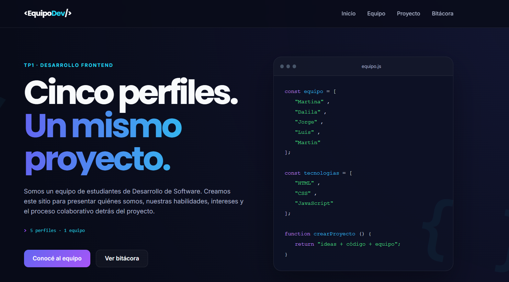

### Perfil de Martina (`martina.html` y `js/martina.js`)

Hola!
Mi perfil tiene una estética tecnológica/gamer y utiliza una **Terminal 2.0** como principal centro de interacción.

Además de mostrar información personal, la terminal permite ejecutar comandos, navegar entre secciones y activar distintos módulos visuales desarrollados con JavaScript.

#### Terminal 2.0

La terminal permite ejecutar comandos escritos por el usuario o utilizar botones de acceso rápido.

Entre sus funcionalidades se encuentran:

- ingreso de comandos mediante formulario;
- historial de comandos ejecutados;
- navegación por el historial utilizando las flechas `↑` y `↓`;
- contador dinámico de comandos;
- efecto de escritura progresiva (*typewriter*);
- secuencia de inicio (*boot sequence*);
- activación de la terminal mediante `IntersectionObserver`;
- respuestas dinámicas según el comando ingresado;
- modificación de elementos del DOM;
- cambio de temas visuales.

Algunos de los comandos disponibles son:

- `about`
- `personal`
- `skills`
- `work`
- `game`
- `study`
- `psychology`
- `photography`
- `travel`
- `design`
- `music`
- `status`
- `theme`
- `random`
- `clear`
- `tip`

También existen algunos comandos ocultos utilizados como *Easter Eggs*.

#### Navegación desde la terminal

Algunos comandos no solamente muestran información, sino que también permiten navegar hacia distintas partes del perfil.

Por ejemplo:

- `about` → sección **Sobre mí**;
- `skills` → sección **Habilidades**;
- `music` → sección **Music Explorer**.

Para estos desplazamientos se utiliza `scrollIntoView()`.

Cuando el usuario tiene configurada la opción `prefers-reduced-motion`, el desplazamiento se realiza sin animación.

#### Odin.exe
Uno de los comandos secretos de la terminal es:

`odin`

Al ejecutarlo, JavaScript activa un asistente flotante basado en Odin, la mascota del perfil.
La interacción realiza diferentes acciones:
- detecta el comando ingresado;
- cambia el estado de Odin de SLEEPING a ONLINE;
- muestra dinámicamente la ilustración de Odin;
- selecciona una frase aleatoria mediante Math.random();
- utiliza setTimeout() para mantener el asistente visible durante unos segundos;
- vuelve automáticamente al estado SLEEPING.
De esta manera se combinan manipulación del DOM, estados visuales, temporizadores y contenido dinámico.
Captura — Terminal 2.0 y Odin.exe
En la siguiente captura se observa la ejecución del comando secreto odin y la aparición del asistente en pantalla.
 
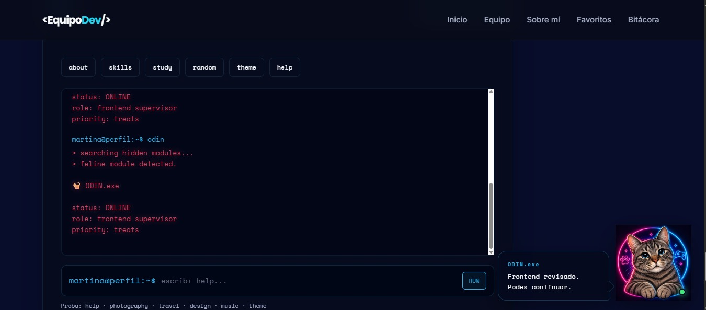

La terminal también permite activar diferentes modos visuales relacionados con intereses personales.
Estos módulos aparecen temporalmente en pantalla y modifican su contenido mediante JavaScript y atributos *data*.

##CAMERA_MODE

El comando:
"potography", activa CAMERA_MODE, un panel inspirado en la interfaz de una cámara.
El módulo incorpora elementos visuales como:
- indicador REC;
- punto de enfoque;
- ISO;
- velocidad de obturación;
- apertura;
- información relacionada con fotografía.

##TRAVEL_MODE

El comando:
"travel", activa TRAVEL_MODE.
Este módulo utiliza una representación tipo radar para acompañar visualmente el interés por viajar y conocer nuevos lugares.
El panel modifica dinámicamente:
- título;
- descripción;
- modo activo;
- representación visual.

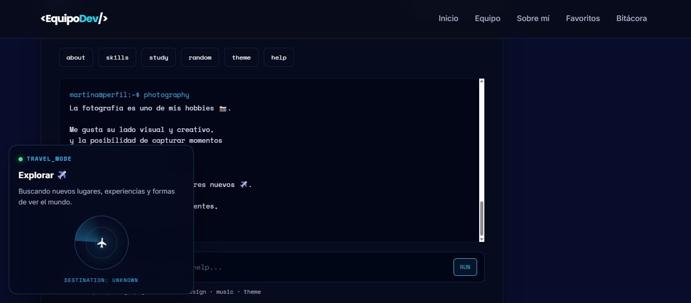

##DESIGN_MODE

El comando:
"design", activa DESIGN_MODE.
Este módulo muestra la identidad cromática utilizada en el perfil y representa visualmente el interés por el diseño aplicado al desarrollo web.
La paleta principal utilizada es:
#080D2C
#31AFE6
#DF3C5D
#7A18C6

##Cinema Explorer
La sección de películas y series incorpora una interacción desarrollada con JavaScript denominada Cinema Explorer.
Las tarjetas reaccionan al:
- pasar el mouse;
- recibir foco mediante teclado;
- hacer click o tocar desde dispositivos táctiles.
Cada tarjeta contiene información mediante atributos data-*.
Cuando una opción es seleccionada, JavaScript actualiza dinámicamente:
- ícono;
- título;
- descripción;
- modo visual;
- formato;
- vibe;
- foco temático.
Los modos utilizados son:
- ACTION_MODE
- SCIENCE_MODE
- CITY_MODE
También se agrega una clase activa a la tarjeta seleccionada para brindar una respuesta visual inmediata.
Music Explorer
La sección musical incorpora otra interacción independiente denominada Music Explorer.
Cada álbum contiene atributos como:
data-album
data-artist

JavaScript utiliza estos datos para actualizar dinámicamente el panel inferior cuando el usuario interactúa con una tarjeta.
Las tarjetas responden a:
- mouseenter;
- foco mediante teclado;
- click o toque.
Además, cada álbum incluye un enlace externo para acceder al contenido musical en YouTube.
Los enlaces utilizan:
target="_blank"
rel="noopener noreferrer"

De esta forma se evita almacenar canciones comerciales dentro del repositorio y el contenido se abre en una nueva pestaña.

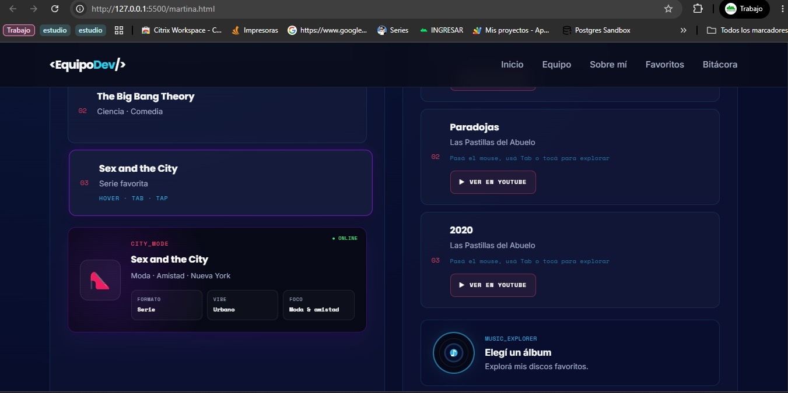

La siguiente captura muestra ambas secciones interactivas funcionando dentro del perfil.
 
Easter Eggs
La Terminal 2.0 también incluye comandos ocultos:
finishhim
fatality

Al ejecutarlos se activa temporalmente un modo especial llamado:
fatality-mode

Además, la interacción puede reproducir el archivo:
audio/fatality.mp3

El sonido únicamente se ejecuta luego de una interacción explícita del usuario, respetando las restricciones de reproducción automática de los navegadores.
Accesibilidad
Durante el desarrollo del perfil también se incorporaron diferentes mejoras de accesibilidad.
Entre ellas:
- navegación mediante teclado;
- estados visibles de foco;
- botones con semántica adecuada;
- uso de aria-live;
- uso de aria-atomic;
- textos alternativos en imágenes;
- enlaces externos con rel="noopener noreferrer";
- soporte para prefers-reduced-motion;
- reducción de animaciones cuando el usuario lo solicita;
- funcionamiento con mouse, teclado y dispositivos táctiles.
Los módulos flotantes también están preparados para evitar superposiciones innecesarias entre distintas interacciones.
Conceptos de JavaScript utilizados
En las distintas interacciones del perfil se aplicaron conceptos como:
- querySelector() y querySelectorAll();
- addEventListener();
- manipulación de classList;
- atributos dataset;
- modificación dinámica de textContent;
- Math.random();
- setTimeout();
- IntersectionObserver;
- scrollIntoView();
- eventos de teclado;
- eventos de mouse;
- formularios;
- arreglos y objetos;
- funciones asincrónicas;
- manipulación dinámica del DOM.

### 3. Perfil de Dalila (`dalila.html` y `js/dalila.js`)

* **Curiosity Explorer (Terminal Interactiva):**
  - Consola/terminal de navegación (`#dalilaExplorer`) con botones contextuales identificados mediante `data-interest` (Tortugas, Astronomía, Egiptología, Creatividad y Curiosidades/Random).

  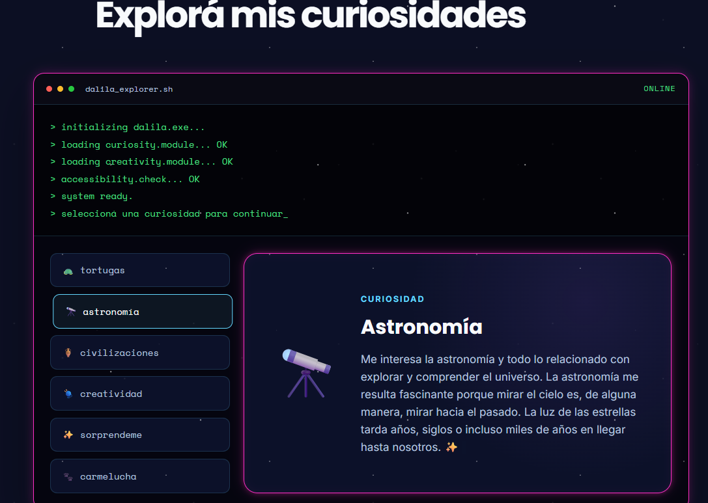

  - Actualización dinámica del DOM con transición suave de desvanecimiento (`fading`) para intercambiar íconos, títulos y textos descriptivos de forma fluida.

* **Asistente Virtual Carmelucha:**
  - Componente flotante interactivo (`#carmeluchaAssistant`) que se activa al seleccionar el botón correspondiente ("Carmelucha") en el menú de intereses.
  - Inyecta consejos dinámicos de desarrollo, buenas prácticas de código y mensajes motivacionales aleatorios que se ocultan automáticamente tras unos segundos.
  - Gestión avanzada de temporizadores (`clearTimeout`) y reinicio de animación de entrada mediante *reflow* del DOM (`offsetWidth`).

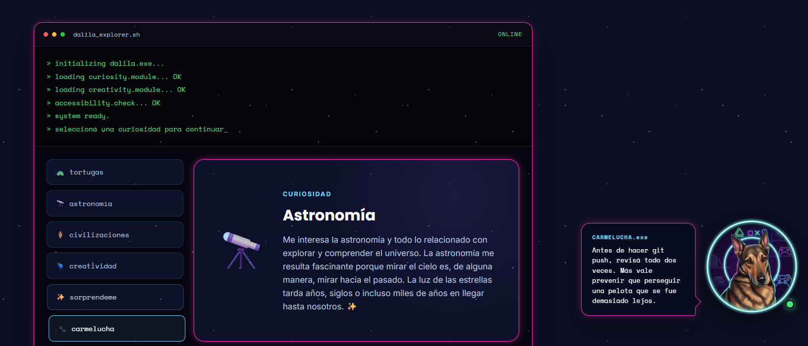

* **Modo Eclipse (Tema Alternativo):**
  - Conmutador de tema visual (`#dalilaEclipseToggle`) que altera la clase `.eclipse-mode` en el elemento `<body>`. Al hacer click en el botón modo eclipse cambian los colores de fondo y al hacer click en modo noche vuelve a la paleta de colores original.

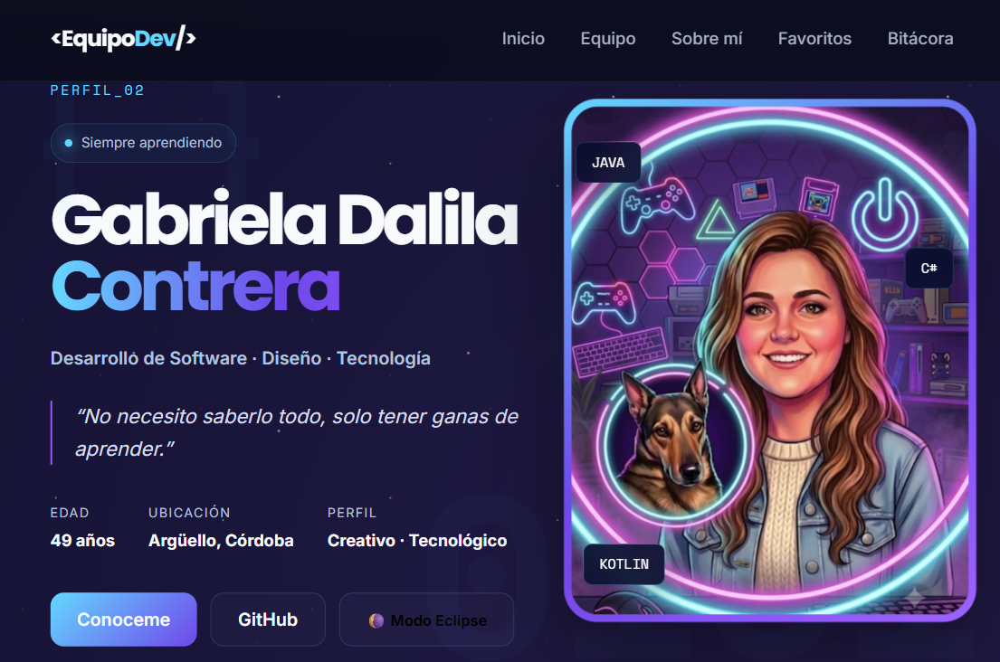

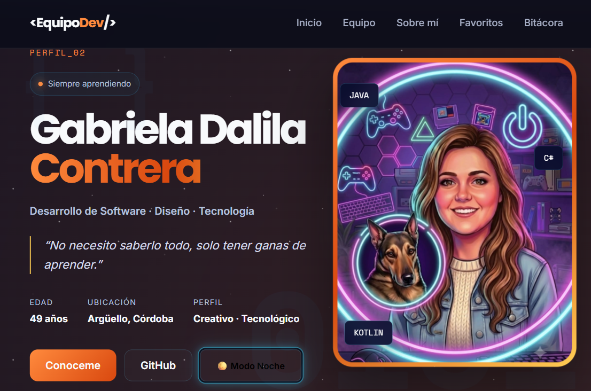

  - Actualización síncrona de texto e indicadores de accesibilidad (`aria-pressed="true/false"`).

* **Accesibilidad Web (Atributos ARIA):**
  - Sincronización dinámica de estados `aria-pressed` y `active` en la botonera de intereses y en el selector de tema.
  - Estructuración semántica con regiones accesibles (`<aside>`, `<article>`, `<header>`, `<main>`, `<footer>`).

* **Diseño y Estética Neón:**
  - Estilos visuales resplandecientes (`box-shadow` e iluminación neón) con respuestas interactivas en estado `:hover`.
  - Fondo espacial con estrellas animadas mediante pseudoelementos y `@keyframes`.

* **Integración Multimedia:**
  - Reproductores embebidos mediante `<iframe>` para tráilers de cine/series y álbumes musicales destacados, configurados con títulos descriptivos (`title`) para accesibilidad.

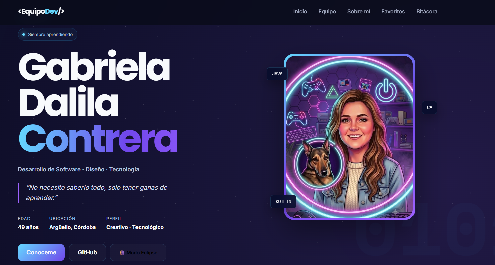

### 4. Perfil de Jorge (`js/jorge.js`)

* **Cyber Console & Modo Inferno:** Procesador interactivo con dactilógrafo DOM recursivo (preserva etiquetas y enlaces externos). Conmuta la clase `.inferno-mode` con variables CSS, fondo de *Scorpion's Lair* (`Scorpion_Lair.jpg`), flash visual y sistema de audio dual (*Shao Kahn* al activar / *No Mercy* al estabilizar).
* **Comandos de consola (`jorgeCommands`):**
  * `python`: Simulación de runtime v3.12 con indicadores de estado color-coded.
  * `music`: Deck de audio con gradiente y enlaces directos a YouTube (*Band-Maid*, *Ling Tosite Sigure*, *Lörihen*).
  * `game`: HUD de ficha de rol/beat 'em up para *D&D: Shadow over Mystara*.
  * `inferno`: Realm merge de *Outworld* con alerta táctica y transiciones de audio.

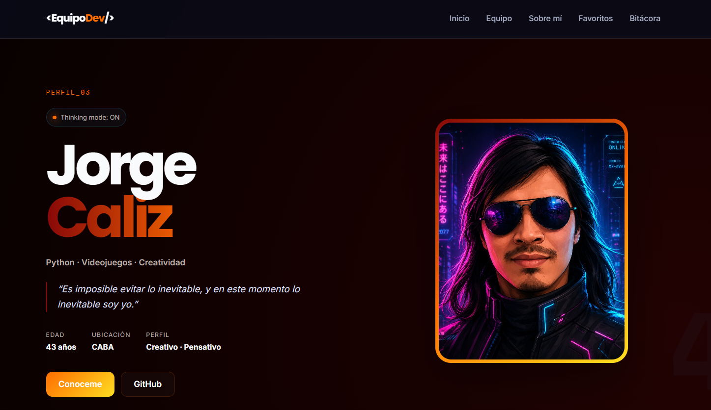

### 5. Perfil de Luis (js/luis.js)

Vintage Player: Botonera interactiva con data-luis que actualiza la carátula, categoría, título y descripción dentro de #luisPlayerDisplay.

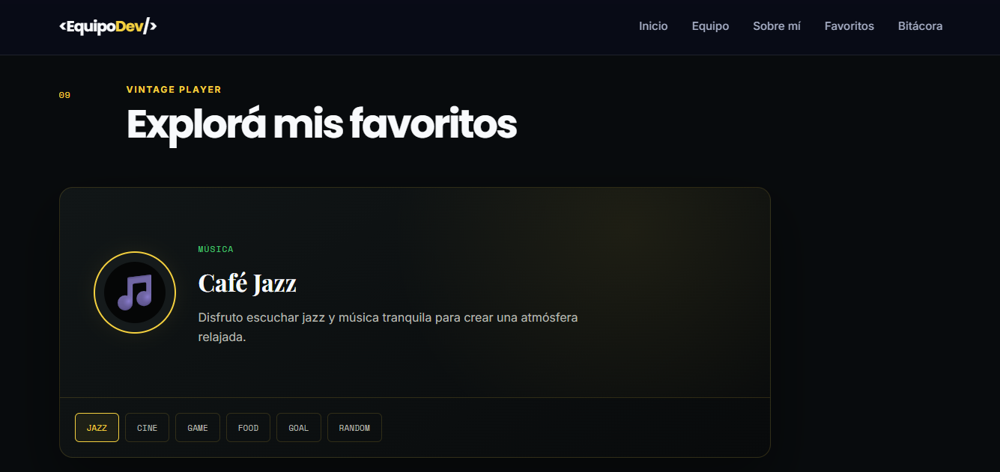
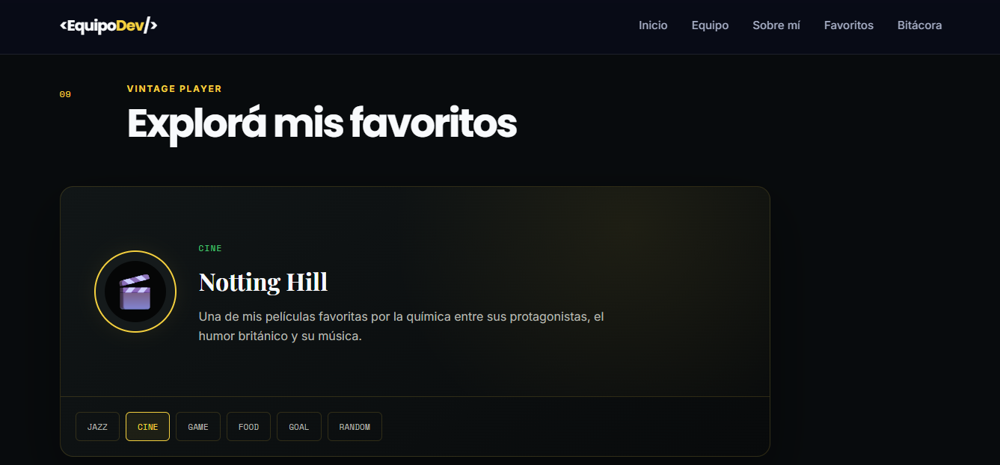

Accesibilidad (A11y) y Atributos ARIA (Completado):
Región Dinámica Accesible: Implementación de aria-live="polite" en #luisPlayerDisplay para anunciar en tiempo real y sin interrupciones los cambios de categoría a usuarios de lectores de pantalla.

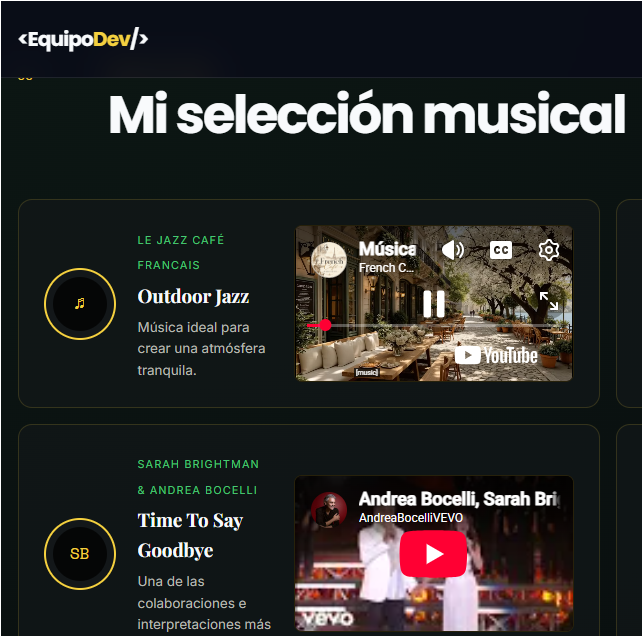

Controles y Estados Interactivos: Incorporación de aria-controls="luisPlayerDisplay" y alternancia dinámica de estado mediante aria-pressed="true|false" en todos los botones del reproductor sincronizados vía JavaScript.
Navegación Semántica y Accesible: Menú mobile accesible con aria-label, aria-expanded y aria-controls, y marcado semántico de paginación entre integrantes mediante <nav class="profile-navigation" aria-label="Navegación entre perfiles">.

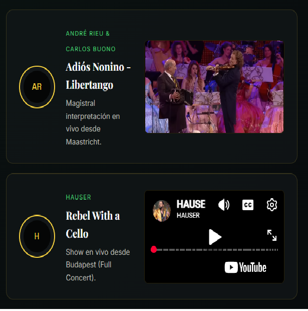

Etiquetado y Ocultamiento Decorativo: Enlaces de retorno al inicio con aria-label="Volver al inicio" (header y footer) y elementos puramente estéticos del hero protegidos con aria-hidden="true".

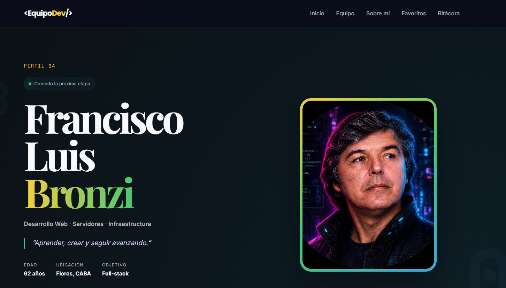

### 6. Perfil de Martín (`martin.html` y `js/martin.js`)

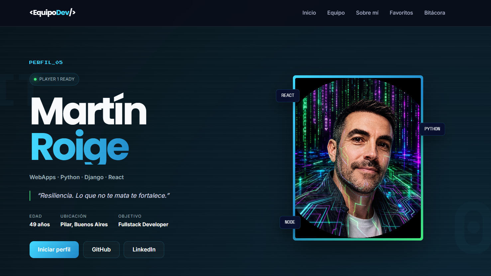

* **Retro System Console (MARTIN OS v1.0):**
  * Consola interactiva inspirada en terminales arcade y sistemas retro de 8 bits (`#martinConsole`).
  * Procesamiento de comandos mediante botones con atributos `data-command`, vinculados dinámicamente por eventos de escucha (`click`).
  * Inyección reactiva de contenido en el DOM con soporte accesible en tiempo real mediante `aria-live="polite"` y `aria-atomic="true"`.
  * Efecto de cursor parpadeante retro implementado vía CSS (`@keyframes martinCursor`).

* **Comandos Interactivos del Sistema (`martinCommands`):**
  * `BOOT`: Ejecuta una rutina de inicialización diagnóstica del sistema ("System Kernel: Online", "Fullstack Engine: Ready", "Logistics DB: Migrated").
  * `STACK`: Despliega el stack tecnológico desbloqueado organizado por categorías (Frontend: HTML, CSS, JS, React; Backend: Node.js, Python, Django; Cloud & DB: MySQL, Supabase, Git).
  * `GAMES`: Muestra el registro de videojuegos clásicos favoritos y títulos de estrategia/RPG (StarCraft, Diablo II: Resurrected).
  * `PETS`: Ejecuta el módulo de monitoreo del hogar detectando las mascotas ("Dogs detected: 3", "Cats detected: 8").
  * `MISSION`: Muestra el objetivo y misión principal de carrera ("Transition to Fullstack Developer").
  * `SWITCH COLOR`: Conmutador dinámico de tema cromático que añade o remueve la clase `.green-mode` en el `body`, alterando al vuelo las variables CSS a una paleta verde fósforo retro (`#65ff94`, `#b4ffcf`).

* **Optimización de Rendimiento y Multimedia:**
  * Implementación de carga diferida (`loading="lazy"`) en los reproductores de YouTube embebidos (`<iframe>`) correspondientes a la selección musical (*Metallica*, *Roxette*, *Imagine Dragons*), reduciendo peticiones bloqueantes en la carga inicial del sitio.
  * Inclusión de títulos descriptivos (`title`) y políticas de seguridad modernas (`referrerpolicy="strict-origin-when-cross-origin"`) en los elementos embebidos.
  * Dimensiones y proporciones explícitas en el contenedor de avatar para prevenir cambios bruscos de diseño (*Cumulative Layout Shift* - CLS).

* **Accesibilidad Web (A11y) y Navegación:**
  * Indicador de foco personalizado (`:focus-visible`) estilizado con estética glow neón, permitiendo una navegación cómoda y visible mediante teclado (Tab).
  * Implementación de `scroll-padding-top` en el viewport para compensar la barra de navegación fija y evitar solapamientos con los títulos de sección al usar anclas internas (`#sobre-mi`, `#habilidades`, `#favoritos`, `#interactivo`).
  * Paginación semántica accesible mediante `<nav class="profile-navigation" aria-label="Navegación entre perfiles">` con botones contextuales hacia el perfil anterior (Luis) y siguiente (Martina).

* **Diseño Responsivo Específico:**
  * Disposición adaptable de las tarjetas de música (`.martin-track`), reorganizando el contenedor del reproductor y la información textual a formato vertical en pantallas móviles para evitar desbordes horizontales.
  * Grid adaptable de habilidades (`.martin-stack-grid`) y rasgos de personalidad (`.martin-stats`), escalando de forma fluida de 4 y 5 columnas en escritorio a 2 columnas en tablets y 1 columna en móviles menores a 400 px.

#### Evidencia de interactividad con JS:
> Animación en bucle del comando `BOOT` en **MARTIN OS v1.0**. Muestra la ejecución asíncrona mediante temporizadores de JavaScript, simulando una secuencia de booteo retro que valida y despliega en tiempo real los módulos del sistema en pantalla.

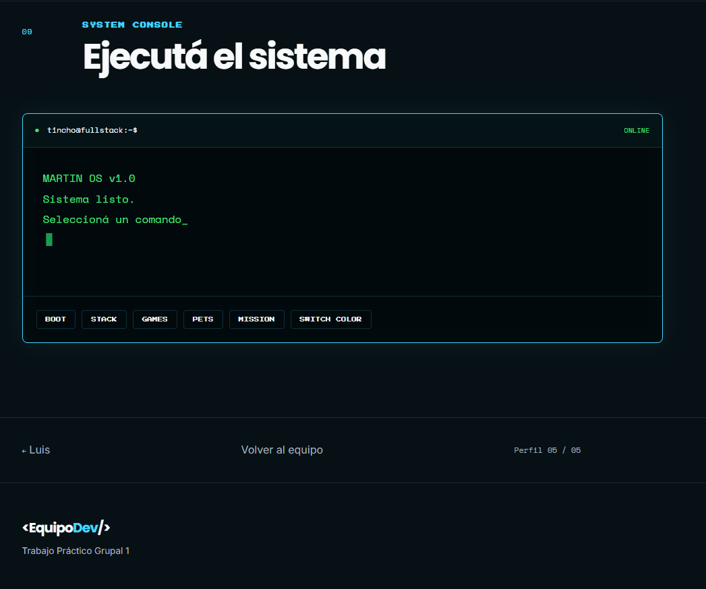

---

## 📱 7. Diseño Adaptable y Breakpoints

El diseño utiliza CSS Grid y Flexbox de forma adaptativa, implementando las directivas solicitadas en la consigna:

* **Breakpoint 1200px (Desktop / Laptop):** Reorganización de grillas de 4 columnas a 3 columnas (`.skills-grid`, `.martin-stack-grid`) y ajuste de márgenes en el hero.
* **Breakpoint 900px (Tablet):** Activación del botón de menú hamburguesa, conversión del Hero a columna simple y colapso de grillas a 2 columnas.
* **Breakpoint 600px:** Grillas de cards e intereses a 1 columna.
* **Breakpoint 400px (Mobile Estrecho):** Adaptación fluida sin desbordes horizontales, apilamiento de controles interactivos al 100% de ancho y escalado tipográfico con `clamp()`.

---

## 🚀 8. Publicación

El proyecto se encuentra desplegado y accesible públicamente a través de **Vercel**:

🌐 **URL de Producción:** [https://tp1-frontend-grupal.vercel.app/](https://tp1-frontend-grupal.vercel.app/)

---

## 📈 9. Sección de Evolución

Propuestas proyectadas para futuras etapas del proyecto:
1. **Persistencia de Datos:** Almacenamiento local (`localStorage`) para recordar el último tema seleccionado en perfiles con modo alternativo (Jorge y Martín).
2. **Consumo de APIs Externas:** Reemplazo de datos estáticos de música y películas por consultas en tiempo real a APIs públicas (ej. OMDb API, Spotify Web API).
3. **Optimización de Animaciones:** Incorporación de *Intersection Observer* para activar animaciones de entrada a medida que el usuario hace scroll.
4. **Formulario de Contacto:** Inclusión de validación en tiempo real con JavaScript en una sección común del equipo.

---

## 🤖 10. Uso de IA y Criterio de Privacidad (Autoría)

* *Herramientas y Modelos:* Se utilizaron modelos de lenguaje (ChatGPT de OpenAI y Claude de Anthropic) en sus planes gratuitos para consulta técnica y asistencia en redacción. Para la generación de los avatares se utilizó además *Gemini* (Google, plan gratuito) y *ChatGPT Plus* (OpenAI, plan pago).
* *Experiencia previa del equipo:* los integrantes cuentan con distintos niveles de experiencia previa en el uso de herramientas de IA generativa — algunos ya las habían utilizado en trabajos anteriores, mientras que para otros fue una de las primeras veces aplicándolas a un proyecto de código.
* *Asistencia Técnica:*
  * Estructuración inicial de plantillas semánticas en HTML5 y atributos ARIA de accesibilidad.
  * Optimización de variables CSS y reglas de especificidad en los selectores temáticos.
  * Debugging de lógica en event listeners para los módulos interactivos en JavaScript Vanilla.
* *Avatares y Recursos Gráficos:* Las imágenes de avatares fueron tratadas y optimizadas para web en formato .jpg/.webp, priorizando una identidad visual uniforme.
  * Los avatares de *Martina Bistagnino, Jorge Caliz, Francisco Luis Bronzi y Martín Roige* se generaron con *ChatGPT Plus* (plan pago), a cargo de Martina Bistagnino, con un criterio visual de estilo *cyberpunk* aplicado como fondo/ambientación en los cuatro casos.
  * El avatar de *Gabriela Dalila Contrera* se generó con *Gemini* (plan gratuito), proporcionando como referencia una foto propia, una foto de su mascota y la imagen de estilo del avatar de Martina, solicitando un resultado visual similar.
* *Criterio de Validación y Autoría:* Cada sugerencia producida por herramientas de IA fue revisada, modificada y probada individualmente por el equipo. El código CSS, la arquitectura de archivos y la lógica de interacción final reflejan decisiones y desarrollo propio de los integrantes del grupo.
